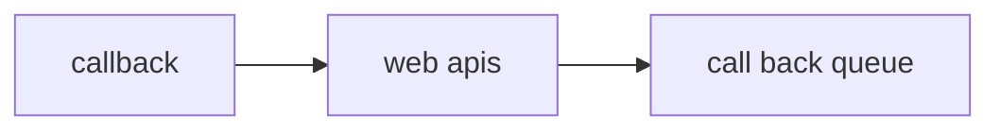

## The phenomena of event contect


## creating a promise 
```js
function add(a,b){
    return new Promise((resolve,reject)=>{
        setTimeout(()=>{
            resolve(a+b)
        },0)
    })
}

add(10,12)
```